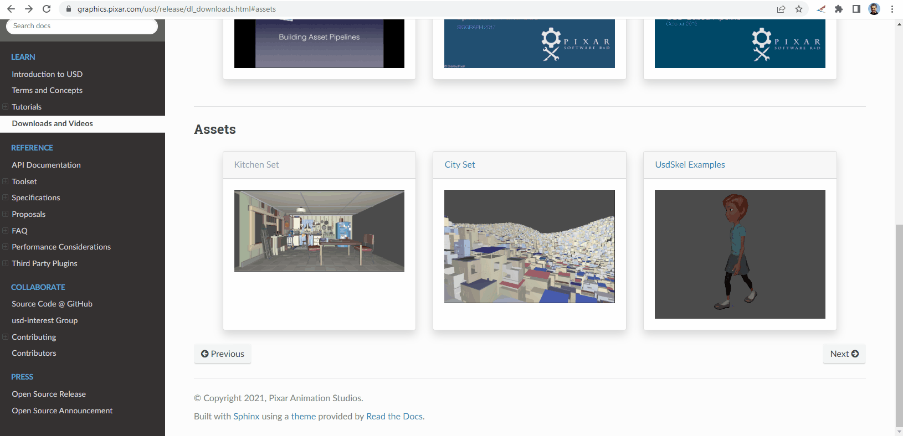
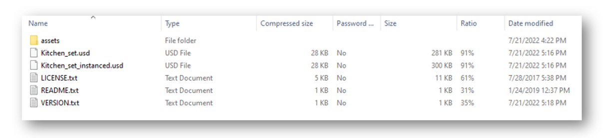
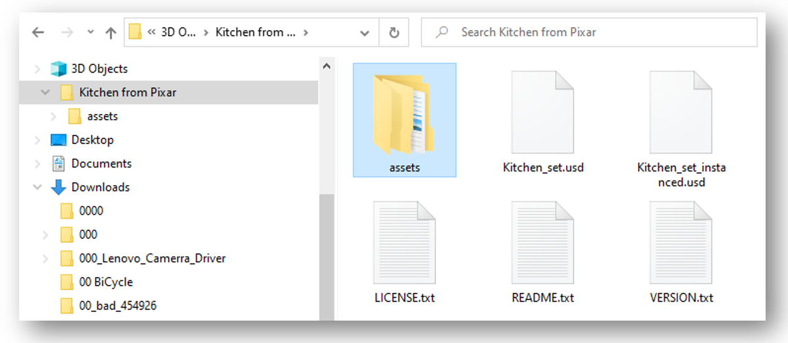
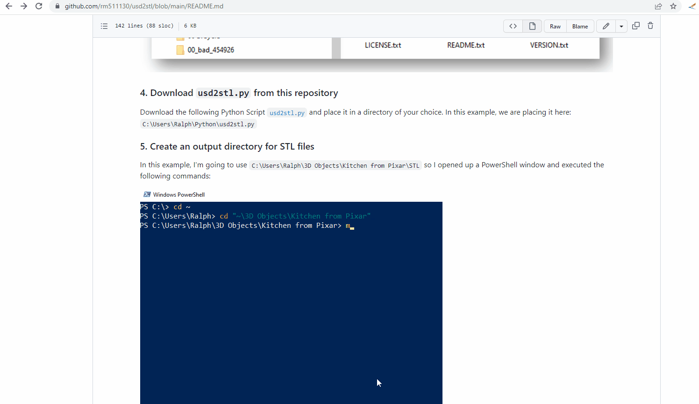
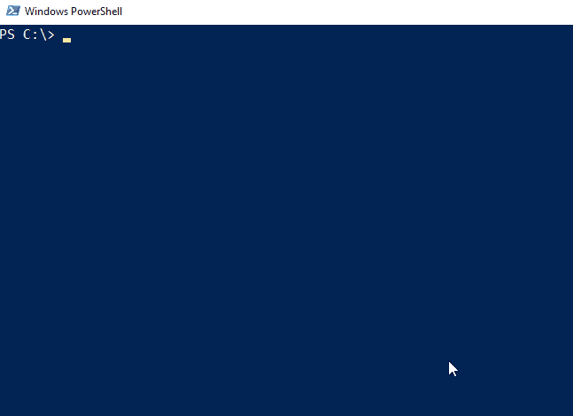
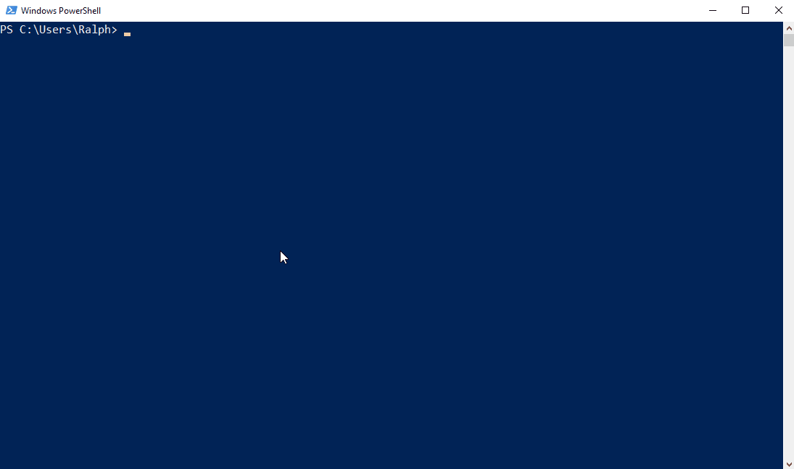

# usd2stl
- Python Script for converting a [USD files](https://graphics.pixar.com/usd/release/usdfaq.html) into [STL format](https://en.wikipedia.org/wiki/STL_(file_format))

   1. Converts a single USD file into a single STL
   2. Converts all subcomponents of a USD file into STLs

## Requirements: 
   - [Blender 3.3 or later](https://www.blender.org/download/) installed on your machine
   - [`usd2stl.py`](https://drive.google.com/file/d/1fQ86X2rZ2DFZ3mFaEIMTWU-M9-b2ZQTK/view?usp=sharing)
   - [`PZ2.usd`](https://drive.google.com/file/d/1fJyewo1JMThtBwSZkCKmwBoyg-MuD1mp/view?usp=sharing) in case you wish to test the procedure and don't have your own `.usd` file
   - Windows OS (access to [PowerShell](https://learn.microsoft.com/en-us/powershell/scripting/learn/ps101/01-getting-started?view=powershell-7.2#where-do-i-find-powershell)) or MacOS (access to [Terminal](https://support.apple.com/guide/terminal/open-or-quit-terminal-apd5265185d-f365-44cb-8b09-71a064a42125/mac))
   
_Note: The Python Code will be executed as headless / background service_

## Command Syntax:

Assuming that you have Blender version 3.3 installed on your machine.

### a. Windows Machines

```
cd "C:\Program Files\Blender Foundation\Blender 3.3"
.\blender.exe -b -P usd2stl.py -- -i <sample.usd> -o output <output-directory> -s <single.stl>
```

### b. MacOS Machines

```
cd /Applications/Blender.app/Contents/MacOS
./blender -b -P usd2stl.py -- -i <sample.usd> -o output <output-directory> -s <single.stl>
```

### In both cases: Windows and MacOs
```
- The <sample.usd> is the file to be converted to STL. 
- The usd2stl.py script will:
     - output one STL per object found in the <sample.usd> file. 
     - append .stl to the object names it finds in the <sample.usd> file. 
     - export the union of all the .stl files as a <single.stl> file.
- The <sample.usd> and <single.stl> placeholders correspond to file-path and file name.
- The <output-directory> placeholder corresponds to a file-path of an existing directory.
```

## How to execute:

### a. Windonws PowerShell Example:

```
C:> cd "C:\Program Files\Blender Foundation\Blender 3.3"
C:> mkdir ~\Downloads\output
C:\Program Files\Blender Foundation\Blender 3.3> .\blender.exe -b -P "C:\Users\Ralph\Downloads\usd2stl.py" -- -i "C:\\Users\\Ralph\\Downloads\\PZ2.usd" -o "C:\\Users\Ralph\\Downloads\\output" -s "C:\\Users\\Ralph\\Downloads\\output\\PZ2.stl"
```

### Notes:
       - Directories referred to in "-i", "-o" and "-s" must already exist
       - Note the need for double backslashes when passing parameters to the Python code

### Output Example: Windows Machine

```
Blender 3.3.1 (hash b292cfe5a936 built 2022-10-04 23:43:02)
USD import of '/Users/rmeira/Downloads/PZ2.usd' took 21.1 ms

Blender quit       
```

### b. MacOS Terminal Example:

```
MacOS> cd /Applications/Blender.app/Contents/MacOS
MacOS> mkdir -p ~/Downloads/output
MacOS> ./blender -b -P ~/Downloads/usd2stl.py -- -i ~/Downloads/PZ2.usd -o ~/Downloads/output -s ~/Downloads/output/PZ2.stl
```

### Output Example: MacOS

```
Blender 3.3.1 (hash b292cfe5a936 built 2022-10-04 23:43:02)
USD import of '/Users/rmeira/Downloads/PZ2.usd' took 21.1 ms

Blender quit
```

### Where:
```
-b = background or headless

-P = Python

Python Script = ~/Downloads/usd2stl.py 

-- = subsequent parameters are inputs for the Python code

-i = input USD file name and location
     Example of USD file name and location = ~/Downloads/PZ2.usd

-o = output directory where all USD subcomponents will be saved as STL files
     Example of output directory: ~/Downloads/output

-s = file name and location of single STL file conversion from USD file
     Example of Single STL file name and location: ~/Downloads/output/PZ2.stl
```

### Notes:
       - Directories referred to in "-i", "-o" and "-s" must already exist
       - `~` corresponds to your home directory under which is found the `Downloads` directory

# Step-by-Step Tutorial

This tutorial will show you how to use this tool to convert a USD file into STL format

### 1. Make sure you have Blender 3.3 or later installed on your machine.

You can find Blender for PCs, MacOs and Linux machines at: https://www.blender.org/download/

### 2. Download examples of USD files 

- A good source of USD files can be found here: https://graphics.pixar.com/usd/release/dl_downloads.html#assets



In the example above, `kitchen_set.zip` is being downloaded to my `C:\Users\Ralph\Downloads` directory.

### 3. Unzip the contents of the `Kitchen_set.zip` file and place them in a directory of your choice:

When opening the `Kitchen_set.zip` file, you will see a directory structure that looks like this:



- Take these files and place them in a directory of your choice. 
- For this tutorial, we will place the files under `C:\Users\Ralph\3D Objects\Kitchen from Pixar` per the example shown below:



### 4. Download `usd2stl.py` from this repository

Download the following Python Script [`usd2stl.py`](https://drive.google.com/file/d/1fQ86X2rZ2DFZ3mFaEIMTWU-M9-b2ZQTK/view?usp=sharing) and place it in a directory of your choice. In this example, we are placing it here: `C:\Users\Ralph\Python\usd2stl.py`



### 5. Create an output directory for STL files

- This is a simple but important step in the process. If an output directory does not exist, the Python code won't be able to write the STL files and will fail.
- In this example, I'm going to use `C:\Users\Ralph\3D Objects\Kitchen from Pixar\STL` so I opened up a PowerShell window and executed the following commands:



### 6. Execute the USD to STL conversion process
   
In this example, we are going to convert `C:\Users\Ralph\3D Objects\Kitchen from Pixar\Kitchen_set.usd` to STL format.
   
Inside a PowerShell window, execute the following command as shown in the animated example shown below:
   
```
blender.exe -b -P usd2stl.py -- -i <sample.usd> -o output <output-directory> -s <single.stl>
```


   
Note: the command used in the animation above is a one-liner, i.e., it's a long, single, one line command. We broke the command and entered it in sections for ease of comprehension, by using the backtick symbol "`".  The multi-line and one-line versions of the command are shown below:

```
PS C:\Program Files\Blender Foundation\Blender 3.3>  .\blender.exe -b -P "C:\Users\Ralph\Python\usd2stl.py" -- `
>> -i "C:\\Users\\Ralph\\3D Objects\\Kitchen from Pixar\\Kitchen_set.usd" `
>> -o "C:\\Users\\Ralph\\3D Objects\\Kitchen from Pixar\\STL" `
>> -s "C:\\Users\\Ralph\\3D Objects\\Kitchen from Pixar\\STL\\Kitchen_set.stl"
```

```
PS C:\Program Files\Blender Foundation\Blender 3.3>  .\blender.exe -b -P "C:\Users\Ralph\Python\usd2stl.py" -- -i "C:\\Users\\Ralph\\3D Objects\\Kitchen from Pixar\\Kitchen_set.usd" -o "C:\\Users\\Ralph\\3D Objects\\Kitchen from Pixar\\STL" -s "C:\\Users\\Ralph\\3D Objects\\Kitchen from Pixar\\STL\\Kitchen_set.stl"
```
   
Note: It's **very important** to use double-backslashes when passing parameter values to the Python Script per the examples shown above.

### 7. Reviewing the results

- Windows comes with a native 3D Viewer, so we need only double-click on any of the STL files created above to visualize them.
- Let's open the `Kitchen_set.stl` file - the largest file that corresponds to the `kitchen_set.usd` file - and then let's open some of its sub-component files as shown in the animation below: 


   
   


